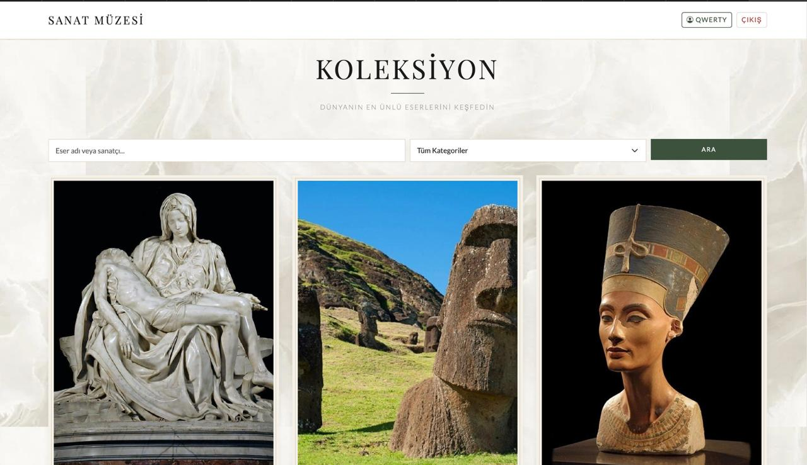

# Sanat Müzesi

*Dünyanın en ünlü sanat eserlerini keşfedebileceğiniz, kategorilerine göre filtreleyip arayabileceğiniz, beğendiğiniz eserleri favorilerinize ekleyip toplulukla etkileşime geçebileceğiniz modern ve güvenli bir web uygulamasıdır.*

---

> *"Sanat asla bitmez. Sadece terk edilir." © Leonardo Da Vinci"*

---

**Canlı Demo:** [http://95.130.171.20/~st24360859922](http://95.130.171.20/~st24360859922)

**Tanıtım Videosu:** [https://youtu.be/y-5IXS5a_pA](https://youtu.be/y-5IXS5a_pA?si=sFvzvGth1foneC3p)

---

## Geliştiriciler

| | İsim | Numara |
|:---:|:---|:---|
| ☾ | *Madina Yusupova* | 24360859922 |
| ☼ | *Feyza Yavuz* | 24360859055 |
| ♥︎ | *Nurseza Karakaya* | 24360859038 |

---

## Ekran Görüntüleri

### *Ana Sayfa — Koleksiyon Galerisi*


### *Eser Detay Sayfası*


### *Kullanıcı Girişi ve Profil Paneli*


---

## Özellikler

*Bu uygulama, modern bir sanat müzesinin dijital deneyimini sunmak amacıyla geliştirilmiştir.*

- **Kullanıcı Yönetimi** — *Güvenli kayıt, giriş ve oturum (Session) yönetimi*
- **Profil Paneli** — *Kullanıcı adı ve şifre güncelleme*
- **Galeri & Arama** — *Eserleri isme, sanatçıya veya türe göre arama ve filtreleme*
- **Favoriler** — *AJAX / Fetch API ile asenkron favori ekleme ve çıkarma*
- **Yorumlar** — *Eserlere yorum yapma; yalnızca kendi yorumunu silme yetkisi*
- **Güvenlik** — *PDO Prepared Statements, htmlspecialchars ve password_hash() (BCrypt)*

---

## Kullanılan Teknolojiler

| Katman | Teknoloji |
|:---|:---|
| *Backend* | PHP 8.x (saf, framework kullanılmadı) |
| *Veritabanı* | MySQL / MariaDB |
| *Frontend* | HTML5, CSS3, JavaScript |
| *UI Framework* | Bootstrap 5 & Bootstrap Icons |
| *Tipografi* | Playfair Display & Lato (Google Fonts) |

---

## Veritabanı Mimarisi

*Proje, ilişkisel bir veritabanı modeli üzerine kurulmuştur ve 4 temel tablodan oluşmaktadır.*

| Tablo | Açıklama | Temel Alanlar |
|:---|:---|:---|
| `kullanicilar` | *Kullanıcı bilgileri ve şifre hash'leri* | `id`, `kullanici_adi`, `email`, `sifre_hash` |
| `eserler` | *Sanat eseri detayları* | `id`, `eser_adi`, `sanatci`, `yil`, `tur`, `aciklama`, `gorsel_yolu` |
| `favoriler` | *Kullanıcı–eser beğeni ilişkisi* | `id`, `kullanici_id`, `eser_id` |
| `yorumlar` | *Eserlere yapılan yorumlar* | `id`, `kullanici_id`, `eser_id`, `icerik`, `olusturma_tarihi` |

---

## Kurulum

*Projeyi yerel ortamınızda (XAMPP, WampServer vb.) çalıştırmak için:*

**1. Repoyu klonlayın**
```bash
git clone https://github.com/madineyusuf/sanat_muzesi.git
cd sanat_muzesi
```

**2. Veritabanını oluşturun**

*phpMyAdmin veya MySQL CLI üzerinden `db.sql` dosyasını içe aktarın.*

**3. Bağlantı ayarlarını yapın**

```bash
cp includes/db.example.php includes/db.php
```

*`includes/db.php` dosyasını açıp kendi veritabanı bilgilerinizi girin.*

**4. Görselleri ekleyin**

*`assets/images/artworks/` klasörüne eser görsellerini yükleyin.*

---

## Güvenlik Notları

>  *`includes/db.php` dosyası `.gitignore` ile versiyon kontrolünden hariç tutulmuştur. Bu dosyayı asla herkese açık bir repoya yüklemeyin.*

---

*© BM BTÜ 2026 — Sanat Müzesi *i_adi/repo_adi.git](https://github.com/kullanici_adi/repo_adi.git)
cd repo_adi
